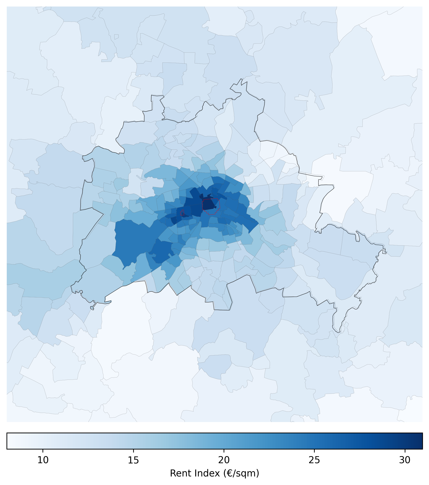
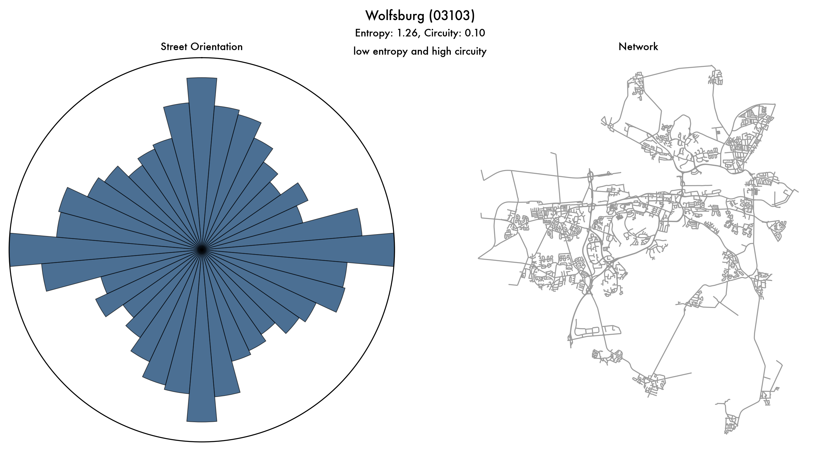

## Discussion Papers

### Price of Productivity

*with Gabriel Ahlfeldt, Stephan Heblich & Tobias Seidel*

We construct a new micro-geographic commercial rent index for Germany to study the capitalization of agglomeration economies into floor space prices. In large local labor markets, commercial rents decline by 17\% per kilometer from the central business district, compared to 13\% for residential rents, reflecting stronger agglomeration benefits at the center. Commercial rents in central business districts increase with local labor market size at an elasticity of 15\%, implying that wage responses capture only about half of the agglomeration effect on total factor productivity.

:::: {layout-ncol=2}
{fig-alt="Commercial rent index for Berlin in 2024"}

👉 Read the full [[Draft]](https://github.com/Ahlfeldt/DPs/blob/main/GA_SH_TS_FY_-_Productivity.pdf){target="_blank"}.

👉 Or the [[BSoE Insight Piece]](https://berlinschoolofeconomics.de/insight/the-price-of-productivity){target="_blank"} for a short read.

👉 Access the dataset for [[Germany Commercial Rent Index]](https://github.com/Ahlfeldt/AHSY-toolkit/tree/main/APPLICATIONS/GERMANY/DATA){target="_blank"} at postcode level from 2007 to 2024.

## Work in Progress

### Curvy Cities

*term paper of the course Quantitative Spatial Econonomics in 2025 Summer Semester at Humboldt Univeristy by Gabriel Ahlfeldt*

I examine how street-network features shapes economic activity using data for 401 German counties. Orientation entropy and circuity are computed from OpenStreetMap
and linked to exogenous fundamentals inverted from a quantitative spatial model. Ge-
ography explains a sizable share of variation in circuity but little of entropy, indicating distinct dimensions of network form. I find circuity is robustly positively correlated with fundamental productivity, while entropy’s correlation vanishes once population density is controlled for. Circuity is negatively related to density, consistent with reduced effective land supply in more circuitous networks. Heterogeneity analysis shows that the productivity–circuity link is driven by non-city observations. These findings highlight that network feature is both shaped by first nature geography and intertwined with agglomeration through other mechanisms.

{fig-alt="Street network map and orientation of Wolfsburg" width="60%" fig-align="center"}

**Presented at:** Urban and Spatial Economics PhD Workshop, CREST, Paris.